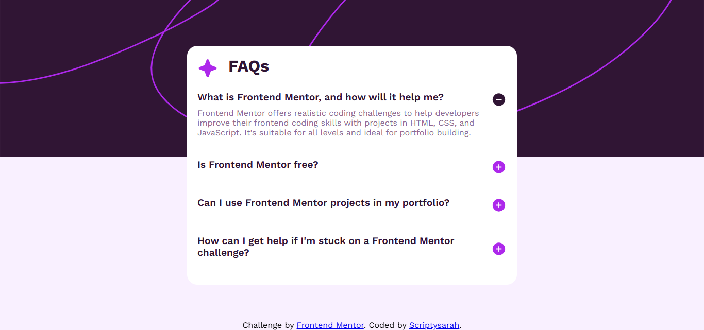

# Frontend Mentor - FAQ accordion solution

This is a solution to the [FAQ accordion challenge on Frontend Mentor](https://www.frontendmentor.io/challenges/faq-accordion-wyfFdeBwBz). Frontend Mentor challenges help you improve your coding skills by building realistic projects. 

## Table of contents

- [Overview](#overview)
  - [The challenge](#the-challenge)
  - [Screenshot](#screenshot)
  - [Links](#links)
- [My process](#my-process)
  - [Built with](#built-with)
  - [What I learned](#what-i-learned)
  - [Useful resources](#useful-resources)
- [Author](#author)

## Overview

### The challenge

Users should be able to:

- Hide/Show the answer to a question when the question is clicked
- Navigate the questions and hide/show answers using keyboard navigation alone
- View the optimal layout for the interface depending on their device's screen size
- See hover and focus states for all interactive elements on the page

### Screenshot

### Links

- Solution URL: [Solution](https://github.com/scriptysarah/frontendmentor/tree/main/FAQ%accordion)
- Live Site URL: [Live](https://scriptysarah.github.io/frontendmentor/FAQ%accordion/)

## My process

### Built with

- Semantic HTML5 markup
- CSS custom properties
- Flexbox
- CSS Grid
- Mobile-first workflow

### What I learnt

I learnt how to hide elements and show them on click.I also figured how to use @media query along with making my page keyboard navigation friendly! 

### Useful resources

- [medium](https://medium.com/@francesco-saviano/building-a-simple-faq-accordion-with-html-css-and-javascript-2a8aed32badf) - This helped me for the js. I really liked how they explained their code so it was easier for me to know how to use it in my case

## Author

- Frontend Mentor - [@scriptysarah](https://www.frontendmentor.io/profile/scriptysarah)

